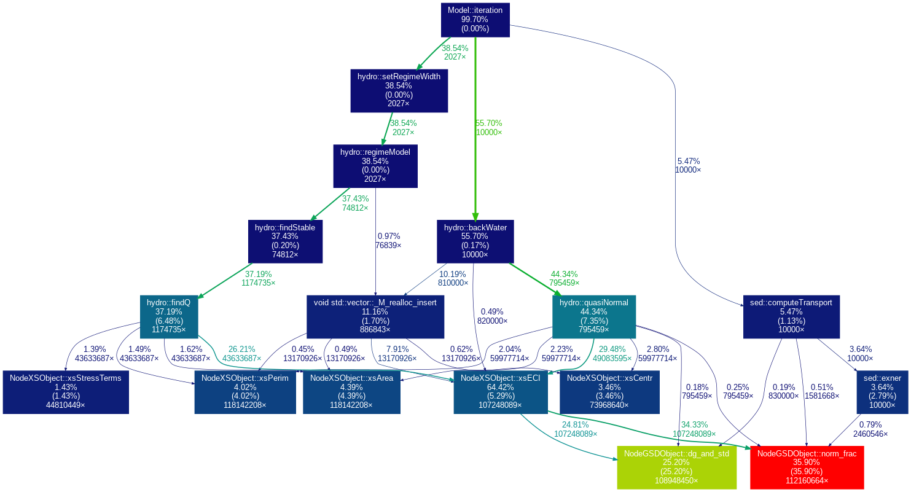

# NeSI Project

## Goals

* improve user interface
* help with setting up repository and code structure
* improve performance if possible


## Repository

Initial setup:

* Pushed "Zip file" version to `master` branch
* Working in `xml-input-merge` branch (will do a pull request)


## Input files

Convert input files from custom format to XML (that can be exported from Excel).

* Added `tinyxml2` library for reading in the XML files
* Converted *Input_Rip1_equil_1938.dat*
  - made some assumptions, e.g. `npts = nnodes` (`npts` was not defined in the
    xml file but was in the old dat input file) - **needs to be checked**
  - made up xml structure for stratigraphy - **needs to be checked**
* Converted *hydro_series.dat* and *sed_series.dat*
  - made some assumptions about the XML structure here - **needs to be checked**

If the default input file does not exist, the GUI version will pop up a dialog
to ask for the location of the input file.


## CMake build

Some benefits of CMake:

* better option handling (headless vs GUI builds)
* automatically finding dependencies
* automates running tests and checking results
* works well with Qt
* can build the code with something other than QtCreator (e.g. MSVC)

In QtCreator just load the `CMakeLists.txt` file instead of the old GrateRip.pro.

To build with CMake on the command line:

```
# create build directory (can be called something else) and change to it
mkdir build && cd build

# configure
#  -DBUILD_GUI=ON is the default (build the GUI/Qt version)
#  -DBUILD_CLI=ON is the default (build the headless version)
cmake ..

# compile (using 4 cores)
make -j4
```

To run the tests:

```
ctest --output-on-failure
```


## Separate Model and GUI code

To be able to have a headless/command line interface version, the GUI and model
parts in *mainwindow.cpp* were separated. The model parts were put into a new
class in *model.cpp*. This will enable runs on NeSI, such as parameter sweeps,
where no GUI libraries are needed.


## Headless / CLI version

A headless version was added to the CMake build. It is enabled by default but
can be disabled with the configuration option:

```
cmake -DBUILD_CLI=OFF ..
```

There was still a dependency on Qt due to the use of `QDateTime`. This was removed
by adding a custom date/time object in *gratetime.cpp*.

The headless version now builds without any dependency on Qt.

### Headless vs GUI performance

Comparing headless vs GUI versions, running for 10,000 timesteps:

- GUI version: 120.81 seconds
- CLI version:  78.14 seconds

The headless version gives a 1.5x speedup over the GUI version (35% reduction
in run time).


## Testing

* using `ctest` to make it easier to run tests
* added one main test that runs for 800 time steps and compares the output to
  a reference version
* added some custom code for comparing against a reference file with some
  tolerance


## Continuous integration

* automatically builds the code and runs tests when pushing changes to the repository
* notifies you if the build or any tests fail

See [my fork](https://github.com/chrisdjscott/GRATE/branches) for example. The green tick
means that branch has passed tests.

### Travis-CI

Travis-CI is used for building on Linux.

Details about the build can be found on the [Travis CI](https://travis-ci.com/chrisdjscott/GRATE/builds/94130621)
website.

There is some one-time configuration that needs to be done to use Travis with
the main repository. Follow steps 1-3
[here](https://docs.travis-ci.com/user/tutorial/#to-get-started-with-travis-ci).

### Appveyor

Appveyor is used for building on Windows. 

Example output from an Appveyor build can be found
[here](https://ci.appveyor.com/project/chrisdjscott/grate/builds/23904550/job/yjqpighwvmua794u).

An [Appveyor](https://www.appveyor.com/) account is required and needs to be linked to your
Github account and the GRATE repository added. 

## Profiling headless version


* `NodeGSDObject::dg_and_std` and `NodeGSDObject::norm_frac` have the most self-time
* In `hydro`: `regimeModel`, `findStable` and `energyConserve` have lots of time under them


## Optimisation in `dg_and_std` and `norm_frac`

A [small change](https://github.com/chrisdjscott/GRATE/commit/98b342caf8a8089d8b651ab27eabd8226ce0a466)
to use statically allocated arrays, instead of `std::vector` results in around 15-20% reduction
in run times (depending on compiler).

The change was from:

```cpp
vector<float> ktot;
ktot.resize(psi.size());
```

to:

```cpp
float ktot[ngsz];
```

There is a (small) overhead to creating a `vector` and resizing it. Since these function get
called a large number of times, making this change resulted in a reasonable performance improvement.

Also, the `ktot` array values were being calculated twice and the second calculation was removed
(i.e. values from the first calculation were reused) as part of this change too.

### Profiling of xml-input-merge branch

Profiling of the branch that includes latest changes from Jon:



## Looking into optimisation routines

Optimisation routines such as `regimeModel`, `findStable`:

* Look into using Brent's method instead of bisection

### Comparison of Brent's method vs bisection in `regimeModel`

A test code was written to compare Brent's method from the GSL library to the
bisection optimiser currently used in `regimeModel`. It gave over 3x speedup for this specific test case.
This is probably an
upper limit on the speedup we can expect since Brent's method uses inverse quadratic interpolation, so will
work well on the quadratic test function. The bracketing method was also improved and this
gain was included in the 3x speedup above.

See the test code and results [here](https://github.com/chrisdjscott/compare-grate-opt).

The stability of these algorithms needs to be improved before this can be implemented and tested within GRATE.

