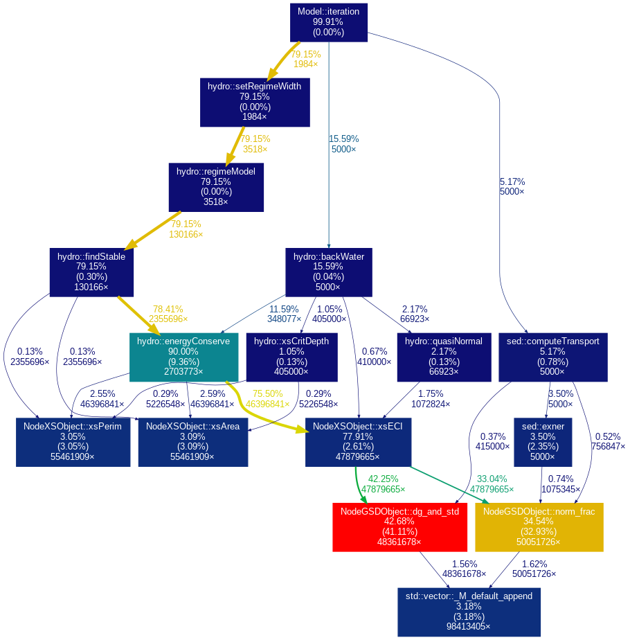

# NeSI Project

## Goals

* improve user interface
* help with setting up repository and code structure
* improve performance if possible


## Repository

* Pushed "Zip file" version to `master` branch
* Working in `xml-input-model` branch (should do a pull request at some point)


## Input files

Change input files to XML (so can be exported from Excel).

* Implemented `tinyxml2` library to read the XML files within the code
* Converted most of *Input_Rip1_equil_1938.dat* (**Still to do:** Stratigraphy array)
* **Still to do:** convert *hydro_series.dat* and *sed_series.dat*


## CMake build

Some benefits of CMake:

* better option handling
* automatically finding dependencies
* automates running tests and checking results
* works well with Qt

To build with CMake:

```
# create build directory and change to it
mkdir build && cd build

# configure
cmake ..

# compile (using 4 cores)
make -j4
```

To run the tests:

```
ctest --output-on-failure
```


## Separate Model and GUI code

To be able to have a headless/command line interface version, the GUI and model
parts in *mainwindow.cpp* were separated. The model parts were put into a new
class in *model.cpp*.


## Headless / CLI version

A headless version was added to the CMake build. To enable it (it is no built by
default), use the additional configuration option:

```
cmake -DBUILD_CLI=ON ..
```

There was still a dependency on Qt due to the use of `QDateTime`. This was removed
by adding a custom date/time object in *gratetime.cpp*.

The headless version now builds without any requirement on Qt.


## Testing

* using `ctest` to make it easier to run
* added some custom code for comparing against a reference file with some tolerance


## Continuous integration


* automatically run tests when pushing changes to the repository
* notifies you if tests fail
* instructions to set up for main repo

See [my fork](https://github.com/chrisdjscott/GRATE/branches) for example. The green tick
means that branch has passed tests.

Details about the build can be found on the [Travis CI](https://travis-ci.com/chrisdjscott/GRATE/builds/94130621)
website.

If you want to use Travis with the main repository then you can follow steps 1-3
[here](https://docs.travis-ci.com/user/tutorial/#to-get-started-with-travis-ci).


## Profiling headless version



* `NodeGSDObject::dg_and_std` and `NodeGSDObject::norm_frac` have the most self-time
* In `hydro`: `regimeModel`, `findStable` and `energyConserve` have lots of time under them
